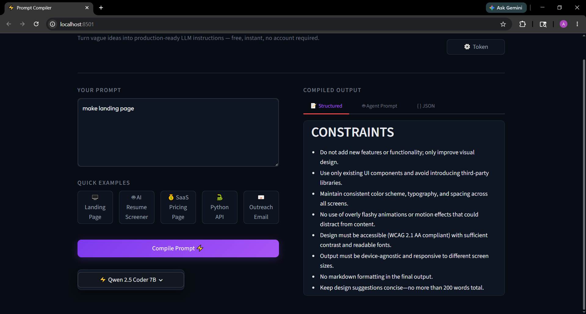
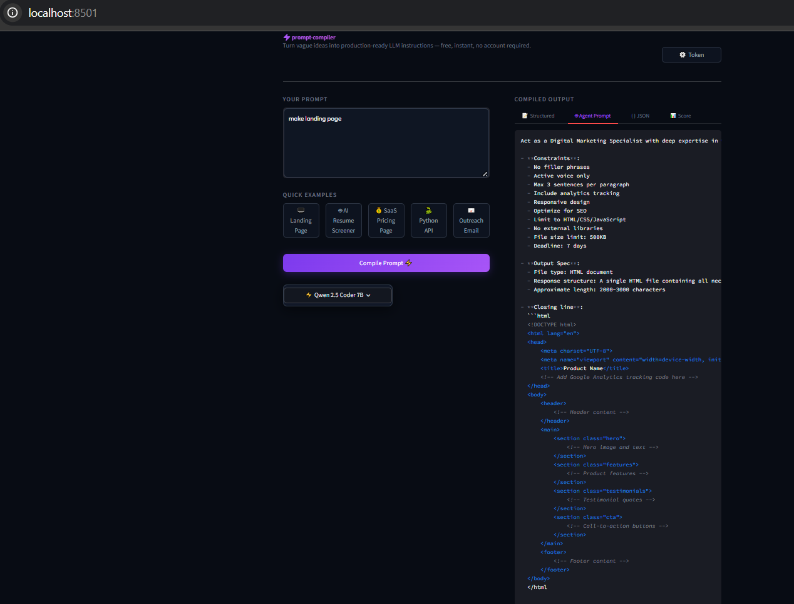
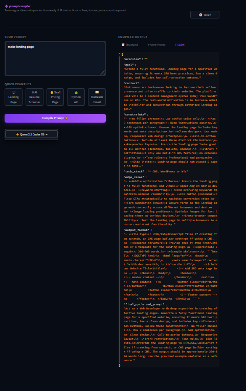

# ⚡ prompt-compiler

> Turn vague ideas into production-ready LLM instructions — free, instant, no account required beyond a Hugging Face token.


---

## What It Does

You type `make landing page`.

You get back a complete, structured prompt template — with an expert persona, scoped objective, concrete constraints, tech stack, edge cases, and a copy-paste-ready final instruction block — that any LLM (ChatGPT, Claude, Gemini, local models) can execute on the first try.

**The compiler analogy is intentional.** A traditional compiler transforms loosely-written source code into a precise, machine-executable artifact. This tool does the same for AI instructions. It analyzes intent, infers missing context, enforces structural constraints, and emits a clean, section-structured prompt template ready for production use.

---

## Features

- **Intent inference** — Expands 2–6 word inputs into fully-specified prompt templates without guessing or hedging
- **Structured output** — Every compiled prompt has GOAL, CONTEXT, CONSTRAINTS, TECH STACK, EDGE CASES, OUTPUT FORMAT, and FINAL OPTIMIZED PROMPT sections
- **Three output views** — Rendered markdown, copyable agent prompt, and raw JSON spec (with built-in code block copying)
- **Auto-fallback models** — If the primary model is rate-limited, the app silently retries the next free-tier model and shows a badge
- **Five quick examples** — Click any chip to instantly fill the input and compile
- **Free tier only** — Uses Hugging Face Router with no paid API; all inference is free
- **Saves outputs locally** — Every compilation is saved as `.json`, `.md`, and `.txt` in `outputs/`
- **No database, no auth, no payments** — Fully self-contained single-page app

---

## Screenshots





---

## Architecture

```
User Input (vague prompt)
        │
        ▼
┌───────────────┐   COMPILER_SYSTEM_PROMPT injected
│  compiler.py  │──────────────────────────────────►
└───────────────┘
        │
        ▼
┌───────────────┐   Hugging Face Router
│    llm.py     │◄────────────────────── router.huggingface.co/v1
└───────────────┘   OpenAI-compatible · auto-fallback chain
        │           Sets `last_used_model` on success
        ▼
┌───────────────┐   parse_sections()       → section dict
│   utils.py    │   extract_final_prompt() → agent-ready text
└───────────────┘   save_output()          → .json / .md / .txt
        │
        ▼
┌───────────────┐   scorer.py  → local heuristic score (0–100)
│    app.py     │   Streamlit UI: 3 tabs, model selector pill/badge
└───────────────┘
```

### Pipeline

| Step | Module | What Happens |
|------|--------|-------------|
| 1. Capture | `app.py` | User types or selects a quick example |
| 2. Compile | `compiler.py` | Wraps input in structured user message with `COMPILER_SYSTEM_PROMPT` |
| 3. LLM call | `llm.py` | Sends to HF Router; retries fallback models on 429/503 |
| 4. Parse | `utils.py` | Splits markdown response into keyed section dict |
| 5. Display | `app.py` | Renders across 3 tabs with model selector pill/badge |
| 6. Save | `utils.py` | Writes `.json`, `.md`, `.txt` to `outputs/` |

---

## Models

All inference runs through the [Hugging Face Router](https://router.huggingface.co) — an OpenAI-compatible endpoint that proxies free-tier models. No paid API key is required.

| Priority | Model | Why |
|----------|-------|-----|
| Primary | `Qwen/Qwen2.5-Coder-7B-Instruct` | Best structure-following on the free tier. Reliably emits exact section headers. |
| Fallback 1 | `Qwen/Qwen3-4B-Instruct-2507` | Newer Qwen architecture, slightly smaller, less likely to be saturated. |
| Fallback 2 | `google/gemma-3n-E4B-it` | Google's efficient instruction-tuned model. Solid at structured output at low token budgets. |

**Fallback logic:** On any `402 / 408 / 409 / 425 / 429 / 500 / 502 / 503 / 504` response or rate-limit signal in the error message, the app silently retries the next model. Auth errors (401 / 403) short-circuit immediately with a clear message. The UI shows a yellow **"Fallback active"** badge when a non-primary model handled the request.

**Generation defaults:** `temperature=0.3`, `max_tokens=1024`. Low temperature maximises structural adherence — the compiled output must follow the exact section schema.

---

## Tech Stack

| Layer | Technology |
|-------|-----------|
| Language | Python 3.11+ |
| Frontend | Streamlit ≥ 1.35 |
| LLM Gateway | Hugging Face Router (`https://router.huggingface.co/v1`) |
| LLM Client | OpenAI Python SDK ≥ 1.30 |
| Environment | `python-dotenv` |
| Testing | pytest |

---

## Getting a Free Hugging Face API Key

1. Go to [huggingface.co/settings/tokens](https://huggingface.co/settings/tokens)
2. Click **New token** → select **Fine-grained**
3. Under **Permissions**, enable **Make calls to Inference Providers**
4. Click **Create token** and copy the value (starts with `hf_`)

> Optionally visit [huggingface.co/settings/inference-providers](https://huggingface.co/settings/inference-providers) to enable specific providers (Fireworks AI, Nebius, Novita, Together AI).

---

## Setup

**1. Clone**
```bash
git clone https://github.com/your-username/prompt-compiler.git
cd prompt-compiler
```

**2. Install dependencies**
```bash
pip install -r requirements.txt
```

**3. Set your token**

Create `.env` in the project root:
```env
HF_TOKEN=hf_xxxxxxxxxxxxxxxxxxxxxxxx
```

Or paste it into the **⚙️ Token** button inside the app — it writes to `.env` for you.

**4. Run**
```bash
streamlit run app.py
```

The app opens at `http://localhost:8501`.

---

## Environment Variables

| Variable | Required | Description |
|----------|----------|-------------|
| `HF_TOKEN` | Yes | Hugging Face fine-grained token with inference provider scope |
| `HF_API_KEY` | Legacy | Accepted as a fallback if `HF_TOKEN` is not set |

Never commit `.env`. It is git-ignored by default.

---

## Example Output

**Input:** `make landing page`

**Compiled:**
```markdown
## GOAL
Build a single-page, conversion-optimised marketing landing page for a SaaS product
that drives sign-up clicks above the fold.

## CONTEXT
The target audience is early-adopter software developers evaluating a new dev tool.
The page will be hosted as a static site (Netlify / Vercel). No CMS or backend needed.

## CONSTRAINTS
- Single HTML file output — no build step, no bundler.
- Dark mode only; no light-mode toggle.
- Zero external JS frameworks; vanilla JS only.
- No Lorem Ipsum — every text element must be placeholder-realistic.
- Hero section must be fully visible on a 1280×800 viewport without scrolling.
- CTA button must have a hover state and focus ring for accessibility.

## TECH STACK
HTML5 · CSS custom properties · Vanilla JS · No frameworks

## EDGE CASES
- Mobile viewport must render without horizontal overflow at 375px width.
- CTA form must validate email format before submit.
- Page must score ≥ 90 on Lighthouse Performance without lazy-loaded images.
- Feature cards must not break layout if copy exceeds two lines.

## OUTPUT FORMAT
One complete, self-contained HTML file with inline `<style>` and a single `<script>` block.
Approximate length: 200–350 lines.

## FINAL OPTIMIZED PROMPT
Act as a Senior Frontend Engineer with 10 years of experience building SaaS marketing pages.
Build a dark-mode, single-page landing page for a developer tool SaaS product. The page
must convert visitors to sign-ups with a compelling above-the-fold hero.
- Output: one self-contained HTML file, inline CSS, vanilla JS only.
- Hero: product name, one-line value proposition, email capture CTA with hover + focus states.
- Sections: features (3 cards), social proof (2 quotes), pricing teaser, footer with links.
- Constraints: zero frameworks, no Lorem Ipsum, mobile-first at 375px, dark palette only.
- Deliver the complete file. No explanations. No code fences.
```

---

## Running Tests

```bash
pytest tests/ -v
```

120 tests covering all modules:

| File | Tests | Covers |
|------|-------|--------|
| `tests/test_scorer.py` | 35 | All 5 scoring dimensions, caps, empty input, unicode, edge cases |
| `tests/test_utils.py` | 37 | Section parsing, final prompt extraction, diff generation, file I/O |
| `tests/test_compiler.py` | 14 | Input validation, model passthrough, error propagation |
| `tests/test_llm.py` | 34+ | Token resolution, fallback chain, auth errors, temperature clamping |

---

## Project Structure

```
prompt-compiler/
├── app.py           — Streamlit UI, settings modal, compile handler
├── compiler.py      — Wraps raw input into structured LLM request
├── llm.py           — HF Router client, fallback chain, last_used_model tracking
├── prompts.py       — COMPILER_SYSTEM_PROMPT and quick example definitions
├── scorer.py        — Local heuristic scorer (0–100, 5 dimensions)
├── utils.py         — File I/O, diff generation, section parsing
├── requirements.txt
├── .env             — HF_TOKEN (git-ignored)
├── examples/        — Sample raw input files
├── outputs/         — Auto-generated compiled results (git-ignored)
├── tests/           — pytest test suite
│   ├── test_scorer.py
│   ├── test_utils.py
│   ├── test_compiler.py
│   └── test_llm.py
└── assets/
    └── screenshot.png
```

---

## How It Helps LLM Users

**Reduces hallucinations.** Vague prompts force the model to fill gaps with guesses. A compiled prompt narrows the instruction space so nothing is left to chance.

**Transfers across models.** The structured format (GOAL / CONSTRAINTS / TECH STACK / EDGE CASES / FINAL PROMPT) is model-agnostic and works equally in ChatGPT, Claude, Gemini, or any local LLM.

**Teaches prompt engineering.** The diff between a raw input and a compiled output makes the gaps visible. Users learn which components they habitually omit (constraints, format spec, persona).

**Speeds up development.** For developers building LLM-powered apps, the compiled prompt can be dropped directly into a system message. The JSON export (`outputs/*.json`) is structured for programmatic consumption.

---

## Roadmap

- **Multi-agent refinement** — Run compiled output through a critique agent and a revision agent in a feedback loop
- **Prompt benchmarking** — Test a compiled prompt across all model tiers and surface a quality comparison table
- **Prompt compression** — Reduce token count of complex templates without losing structural clarity
- **Snapshot history** — Store and diff named iterations of the same base prompt over time
